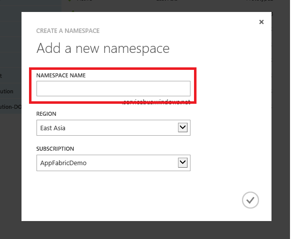
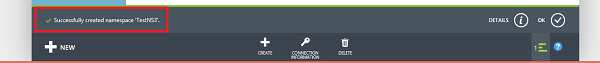
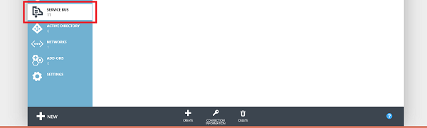
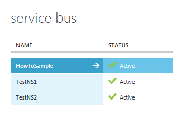

<properties urlDisplayName="Service Bus Queues" pageTitle="How to use Service Bus queues (Java) - Azure" metaKeywords="Azure Service Bus queues, Azure queues, Azure messaging, Azure queues Java" description="Learn how to use Service Bus queues in Azure. Code samples written in Java." metaCanonical="" services="service-bus" documentationCenter="Java" title="How to Use Service Bus Queues" authors="robmcm" solutions="" manager="wpickett" editor="mollybos" videoId="" scriptId="" />

<tags ms.service="service-bus" ms.workload="tbd" ms.tgt_pltfrm="na" ms.devlang="Java" ms.topic="article" ms.date="09/25/2014" ms.author="robmcm" />

# Practical 4: How to Use Service Bus Queues

This guide will show you how to use Service Bus queues. The samples are
written in Java and use the [Azure SDK for Java][]. The
scenarios covered include **creating queues**, **sending and receiving
messages**, and **deleting queues**.

## Table of Contents

-   [What are Service Bus Queues?][]
-   [Create a Service Namespace][]
-   [Obtain the Default Management Credentials for the Namespace][]
-   [Configure Your Application to Use Service Bus][]
-   [How to: Create a Security Token Provider][]
-   [How to: Create a Queue][How to: Create a Security Token Provider]
-   [How to: Send Messages to a Queue][]
-   [How to: Receive Messages from a Queue][]
-   [How to: Handle Application Crashes and Unreadable Messages][]
-   [Next Steps][]

##What are Service Bus Queues?

Service Bus Queues support a **brokered messaging communication**
model. When using queues, components of a distributed application do not
communicate directly with each other, they instead exchange messages via
a queue, which acts as an intermediary. A message producer (sender)
hands off a message to the queue and then continues its processing.
Asynchronously, a message consumer (receiver) pulls the message from the
queue and processes it. The producer does not have to wait for a reply
from the consumer in order to continue to process and send further
messages. Queues offer **First In, First Out (FIFO)** message delivery
to one or more competing consumers. That is, messages are typically
received and processed by the receivers in the order in which they were
added to the queue, and each message is received and processed by only
one message consumer.

Service Bus queues are a general-purpose technology that can be used for
a wide variety of scenarios:

-   Communication between web and worker roles in a multi-tier 
    Azure application
-   Communication between on-premises apps and Azure hosted apps
    in a hybrid solution
-   Communication between components of a distributed application
    running on-premises in different organizations or departments of an
    organization

Using queues can enable you to scale out your applications better, and
enable more resiliency to your architecture.

<h2>Create a Service Namespace</h2>

To begin using Service Bus queues in Azure, you must first
create a service namespace. A service namespace provides a scoping
container for addressing Service Bus resources within your application.

To create a service namespace:

1.  Log on to the [Azure Management Portal][].

2.  In the left navigation pane of the Management Portal, click
    **Service Bus**.

3.  In the lower pane of the Management Portal, click **Create**.   
	

4.  In the **Add a new namespace** dialog, enter a namespace name.
    The system immediately checks to see if the name is available.   
	

5.  After making sure the namespace name is available, choose the
    country or region in which your namespace should be hosted (make
    sure you use the same country/region in which you are deploying your
    compute resources).

	IMPORTANT: Pick the **same region** that you intend to choose for
    deploying your application. This will give you the best performance.

6. 	Click the check mark. The system now creates your service
    namespace and enables it. You might have to wait several minutes as
    the system provisions resources for your account.

	

The namespace you created will then appear in the Management Portal and
takes a moment to activate. Wait until the status is **Active** before
continuing.

<h2>Obtain the Default Management Credentials for the Namespace</h2>

In order to perform management operations, such as creating a queue on
the new namespace, you must obtain the management credentials for the
namespace. You can obtain these credentials from either the Management Portal, or from the Visual Studio Server Explorer.

###To obtain management credentials from the portal

1.  In the left navigation pane, click the **Service Bus** node, to
    display the list of available namespaces:   
	

2.  Select the namespace you just created from the list shown:   
	

3.  Click **Connection Information**.   
	

4.  In the **Access connection information** dialog, find the **Default Issuer** and **Default Key** entries. Make a note of these values, as you will use this information below to perform operations with the namespace.

## Configure Your Application to Use Service Bus

Add the following import statements to the top of the Java file:

	// Include the following imports to use service bus APIs
	import com.microsoft.windowsazure.services.serviceBus.*;
	import com.microsoft.windowsazure.services.serviceBus.models.*; 
	import com.microsoft.windowsazure.services.core.*; 
	import javax.xml.datatype.*;
	
## How to Create a Queue

Management operations for Service Bus queues can be performed via the
**ServiceBusContract** class. A **ServiceBusContract** object is
constructed with an appropriate configuration that encapsulates the
token permissions to manage it, and the **ServiceBusContract** class is
the sole point of communication with Azure.

The **ServiceBusService** class provides methods to create, enumerate,
and delete queues. The example below shows how a **ServiceBusService** object
can be used to create a queue named "TestQueue", with a namespace named "HowToSample":

    Configuration config = 
    	ServiceBusConfiguration.configureWithWrapAuthentication(
          "HowToSample",
          "your_service_bus_owner",
          "your_service_bus_key",
          ".servicebus.windows.net",
          "-sb.accesscontrol.windows.net/WRAPv0.9");

    ServiceBusContract service = ServiceBusService.create(config);
    QueueInfo queueInfo = new QueueInfo("TestQueue");
    try
    {     
		CreateQueueResult result = service.createQueue(queueInfo);
    }
	catch (ServiceException e)
	{
	    System.out.print("ServiceException encountered: ");
        System.out.println(e.getMessage());
        System.exit(-1);
    }

There are methods on QueueInfo that allow properties of the queue to be
tuned (for example: to set the default "time-to-live" value to be
applied to messages sent to the queue). The following example shows how
to create a queue named "TestQueue" with a maximum size of 5GB:

    long maxSizeInMegabytes = 5120;
    QueueInfo queueInfo = new QueueInfo("TestQueue");
    queueInfo.setMaxSizeInMegabytes(maxSizeInMegabytes); 
    CreateQueueResult result = service.createQueue(queueInfo);

Note that you can use the **listQueues** method on **ServiceBusContract**
objects to check if a queue with a specified name already exists within
a service namespace.

## How to Send Messages to a Queue

To send a message to a Service Bus Queue, your application will obtain a
**ServiceBusContract** object. The below code demonstrates how to send a
message for the "TestQueue" queue we created above within our
"HowToSample" service namespace:

    try
    {
        BrokeredMessage message = new BrokeredMessage("MyMessage");
        service.sendQueueMessage("TestQueue", message);
    }
    catch (ServiceException e) 
    {
        System.out.print("ServiceException encountered: ");
        System.out.println(e.getMessage());
        System.exit(-1);
    }

Messages sent to (and received from ) Service Bus queues are instances
of the **BrokeredMessage** class. **BrokeredMessage** objects have a set
of standard methods (such as **getLabel**, **getTimeToLive**,
**setLabel**, and **setTimeToLive**), a dictionary that is used to hold
custom application specific properties, and a body of arbitrary
application data. An application can set the body of the message by
passing any serializable object into the constructor of the
**BrokeredMessage**, and the appropriate serializer will then be used to
serialize the object. Alternatively, a **java.IO.InputStream** can be
provided.

The following example demonstrates how to send five test messages to the
"TestQueue" **MessageSender** we obtained in the code snippet above:

    for (int i=0; i<5; i++)
    {
         // Create message, passing a string message for the body.
         BrokeredMessage message = new BrokeredMessage("Test message " + i);
         // Set an additional app-specific property.
         message.setProperty("MyProperty", i); 
         // Send message to the queue
         service.sendQueueMessage("TestQueue", message);
    }

Service Bus queues support a maximum message size of 256 KB (the header,
which includes the standard and custom application properties, can have
a maximum size of 64 KB). There is no limit on the number of messages
held in a queue but there is a cap on the total size of the messages
held by a queue. This queue size is defined at creation time, with an
upper limit of 5 GB.

## How to Receive Messages from a Queue

The primary way to receive messages from a queue is to use a
**ServiceBusContract** object. Received messages can work in two
different modes: **ReceiveAndDelete** and **PeekLock**.

When using the **ReceiveAndDelete** mode, receive is a single-shot
operation - that is, when Service Bus receives a read request for a
message in a queue, it marks the message as being consumed and returns
it to the application. **ReceiveAndDelete** mode (which is the default
mode) is the simplest model and works best for scenarios in which an
application can tolerate not processing a message in the event of a
failure. To understand this, consider a scenario in which the consumer
issues the receive request and then crashes before processing it.
Because Service Bus will have marked the message as being consumed, then
when the application restarts and begins consuming messages again, it
will have missed the message that was consumed prior to the crash.

In **PeekLock** mode, receive becomes a two stage operation, which makes
it possible to support applications that cannot tolerate missing
messages. When Service Bus receives a request, it finds the next message
to be consumed, locks it to prevent other consumers receiving it, and
then returns it to the application. After the application finishes
processing the message (or stores it reliably for future processing), it
completes the second stage of the receive process by calling **Delete**
on the received message. When Service Bus sees the **Delete** call, it
will mark the message as being consumed and remove it from the queue.

The example below demonstrates how messages can be received and
processed using **PeekLock** mode (not the default mode). The example
below does an infinite loop and processes messages as they arrive into
our "TestQueue":

    	try
	{
		ReceiveMessageOptions opts = ReceiveMessageOptions.DEFAULT;
		opts.setReceiveMode(ReceiveMode.PEEK_LOCK);
	
		while(true)  { 
	         ReceiveQueueMessageResult resultQM = 
	     			service.receiveQueueMessage("TestQueue", opts);
		    BrokeredMessage message = resultQM.getValue();
		    if (message != null && message.getMessageId() != null)
		    {
			    System.out.println("MessageID: " + message.getMessageId());    
			    // Display the queue message.
			    System.out.print("From queue: ");
			    byte[] b = new byte[200];
			    String s = null;
			    int numRead = message.getBody().read(b);
			    while (-1 != numRead)
	            {
	                s = new String(b);
	                s = s.trim();
	                System.out.print(s);
	                numRead = message.getBody().read(b);
			    }
	            System.out.println();
			    System.out.println("Custom Property: " + 
			        message.getProperty("MyProperty"));
			    // Remove message from queue.
			    System.out.println("Deleting this message.");
			    //service.deleteMessage(message);
		    }  
		    else  
		    {        
		        System.out.println("Finishing up - no more messages.");        
		        break; 
		        // Added to handle no more messages.
		        // Could instead wait for more messages to be added.
		    }
	    }
	}
	catch (ServiceException e) {
	    System.out.print("ServiceException encountered: ");
	    System.out.println(e.getMessage());
	    System.exit(-1);
	}
	catch (Exception e) {
	    System.out.print("Generic exception encountered: ");
	    System.out.println(e.getMessage());
	    System.exit(-1);
	} 	

## How to Handle Application Crashes and Unreadable Messages

Service Bus provides functionality to help you gracefully recover from
errors in your application or difficulties processing a message. If a
receiver application is unable to process the message for some reason,
then it can call the **unlockMessage** method on the received message
(instead of the **deleteMessage** method). This will cause Service Bus
to unlock the message within the queue and make it available to be
received again, either by the same consuming application or by another
consuming application.

There is also a timeout associated with a message locked within the
queue, and if the application fails to process the message before the
lock timeout expires (e.g., if the application crashes), then Service
Bus will unlock the message automatically and make it available to be
received again.

In the event that the application crashes after processing the message
but before the **deleteMessage** request is issued, then the message
will be redelivered to the application when it restarts. This is often
called **At Least Once Processing**, that is, each message will be
processed at least once but in certain situations the same message may
be redelivered. If the scenario cannot tolerate duplicate processing,
then application developers should add additional logic to their
application to handle duplicate message delivery. This is often achieved
using the **getMessageId** method of the message, which will remain
constant across delivery attempts.

## Next Steps

Now that you've learned the basics of Service Bus queues, see the MSDN
topic [Queues, Topics, and Subscriptions][] for more information.

  [Azure SDK for Java]: http://azure.microsoft.com/en-us/develop/java/
  [What are Service Bus Queues?]: #what-are-service-bus-queues
  [Create a Service Namespace]: #create-a-service-namespace
  [Obtain the Default Management Credentials for the Namespace]: #obtain-default-credentials
  [Configure Your Application to Use Service Bus]: #bkmk_ConfigApp
  [How to: Create a Security Token Provider]: #bkmk_HowToCreateQueue
  [How to: Send Messages to a Queue]: #bkmk_HowToSendMsgs
  [How to: Receive Messages from a Queue]: #bkmk_HowToReceiveMsgs
  [How to: Handle Application Crashes and Unreadable Messages]: #bkmk_HowToHandleAppCrashes
  [Next Steps]: #bkmk_NextSteps
  [Azure Management Portal]: http://manage.windowsazure.com/
  [Queues, Topics, and Subscriptions]: http://msdn.microsoft.com/en-us/library/windowsazure/hh367516.aspx
