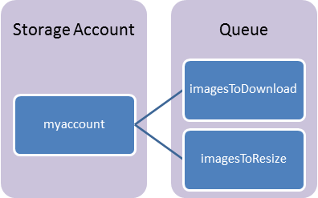

<properties urlDisplayName="Queue Service" pageTitle="How to use the queue service (Java) | Microsoft Azure" metaKeywords="Azure Queue Service, Azure Queue storage service, queues peeking, queues insert messages, queues get messages, queues delete messages, create queues, delete queues, Queue service Java" description="Learn how to use the Azure Queue service to create and delete queues, and insert, get, and delete messages. Samples written in Java." metaCanonical="" services="storage" documentationCenter="Java" title="How to use the Queue storage service from Java" authors="robmcm" solutions="" manager="wpickett" editor="" />

<tags ms.service="storage" ms.workload="storage" ms.tgt_pltfrm="na" ms.devlang="Java" ms.topic="article" ms.date="09/25/2014" ms.author="robmcm" />

# Practical 3: How to use Queue Storage from Java

This guide will show you how to perform common scenarios using the Azure Queue storage service. The samples are written in Java and use the [Azure Storage SDK for Java][]. The scenarios covered include **inserting**, **peeking**, **getting**, and **deleting** queue messages, as well as **creating** and **deleting** queues. For more information on queues, see the [Next steps](#NextSteps) section.

Note: An SDK is available for developers who are using Azure Storage on Android devices. For more information, see the [Azure Storage SDK for Android][]. 

## Table of Contents

* [What is Queue Storage](#what-is)
* [Concepts](#Concepts)
* [Create an Azure storage account](#CreateAccount)
* [Create a Java application](#CreateApplication)
* [Configure your application to access queue storage](#ConfigureStorage)
* [Setup an Azure storage connection string](#ConnectionString)
* [How to: Create a queue](#create-queue)
* [How to: Add a message to a queue](#add-message)
* [How to: Peek at the next message](#peek-message)
* [How to: Change the contents of a queued message](#change-message)
* [How to: Get the queue length](#get-queue-length)
* [How to: Dequeue the next message](#dequeue-message)
* [Additional options for dequeuing messages](#additional-options)
* [How to: List the queues](#list-queues)
* [How to: Delete a queue](#delete-queue)
* [Next steps](#NextSteps)

## What is Queue Storage?

Azure Queue storage is a service for storing large numbers of
messages that can be accessed from anywhere in the world via
authenticated calls using HTTP or HTTPS. A single queue message can be
up to 64 KB in size, and a queue can contain millions of messages, up to the
total capacity limit of a storage account. A storage account can contain up to 200 TB of blob, queue, and table data. See [Azure Storage Scalability and Performance Targets](http://msdn.microsoft.com/en-us/library/dn249410.aspx) for details about storage account capacity.

Common uses of Queue storage include:

-   Creating a backlog of work to process asynchronously
-   Passing messages from an Azure Web role to an Azure
    Worker role

## Concepts

The Queue service contains the following components:

- **URL format:** Queues are addressable using the following URL format:   
	http://`<storage account>`.queue.core.windows.net/`<queue>` 
      
The following URL addresses one of the queues in the diagram:  
	http://myaccount.queue.core.windows.net/imagesToDownload

-**Storage Account:** All access to Azure Storage is done through a storage account. See [Azure Storage Scalability and Performance Targets](http://msdn.microsoft.com/en-us/library/dn249410.aspx) for details about storage account capacity.

- **Queue:** A queue contains a set of messages. All messages must be in a queue.

- **Message:** A message, in any format, of up to 64KB. 

<h2>Create an Azure storage account</h2>

To use Azure storage, you'll need a storage account. You 
can create a storage account by following these steps. (You can also
create a storage account by using the Azure service management client library or the service management [REST API].)

1.  Log into the [Azure Management Portal].

2.  At the bottom of the navigation pane, click **NEW**.

	![New][plus-new]

3.  Click **DATA SERVICES**, then **STORAGE**, and then click **QUICK CREATE**.

	![Quick create dialog][quick-create-storage]

4.  In URL, type a subdomain name to use in the URI for the
    storage account. The entry can contain from 3-24 lowercase letters
    and numbers. This value becomes the host name within the URI that is
    used to address Blob, Queue, or Table resources for the
    subscription.

5.  Choose a Region/Affinity Group in which to locate the
    storage. If you will be using storage from your Azure
    application, select the same region where you will deploy your
    application.

6. Optionally, you can select the type of replication you desire for your account. Geo-redundant replication is the default and provides maximum durability. For more details on replication options, see [Azure Storage Redundancy Options](http://msdn.microsoft.com/en-us/library/azure/dn727290.aspx) and the [Azure Storage Team Blog](http://blogs.msdn.com/b/windowsazurestorage/).

6.  Click **CREATE STORAGE ACCOUNT**.

[using the REST API]: http://msdn.microsoft.com/en-us/library/windowsazure/hh264518.aspx
[Azure Management Portal]: http://manage.windowsazure.com
[plus-new]: ./media/create-storage-account/plus-new.png
[quick-create-storage]: ./media/create-storage-account/quick-storage-2.png

## Create a Java application

In this guide, you will use storage features which can be run within a Java application locally, or in code running within a web role or worker role in Azure.

To do so, you will need to install the Java Development Kit (JDK) and create an Azure storage account in your Azure subscription. Once you have done so, you will need to verify that your development system meets the minimum requirements and dependencies which are listed in the [Azure Storage SDK for Java][] repository on GitHub. If your system meets those requirements, you can follow the instructions for downloading and installing the Azure Storage Libraries for Java on your system from that repository. Once you have completed those tasks, you will be able to create a Java application which uses the examples in this article.

## Configure your application to access queue storage

Add the following import statements to the top of the Java file where you want to use Azure storage APIs to access queues:

    // Include the following imports to use queue APIs.
    import com.microsoft.azure.storage.*;
    import com.microsoft.azure.storage.queue.*;

## Setup an Azure storage connection string

An Azure storage client uses a storage connection string to store endpoints and credentials for accessing data management services. When running in a client application, you must provide the storage connection string in the following format, using the name of your storage account and the Primary access key for the storage account listed in the Management Portal for the *AccountName* and *AccountKey* values. This example shows how you can declare a static field to hold the connection string:

    // Define the connection-string with your values.
    public static final String storageConnectionString = 
        "DefaultEndpointsProtocol=http;" + 
        "AccountName=your_storage_account;" + 
        "AccountKey=your_storage_account_key";

In an application running within a role in Microsoft Azure, this string can be stored in the service configuration file, *ServiceConfiguration.cscfg*, and can be accessed with a call to the **RoleEnvironment.getConfigurationSettings** method. Here's an example of getting the connection string from a **Setting** element named *StorageConnectionString* in the service configuration file:

    // Retrieve storage account from connection-string.
    String storageConnectionString = 
        RoleEnvironment.getConfigurationSettings().get("StorageConnectionString");

The following samples assume that you have used one of these two methods to get the storage connection string.

## How to: Create a queue

A **CloudQueueClient** object lets you get reference objects for queues. The following code creates a **CloudQueueClient** object. (Note: There are additional ways to create **CloudStorageAccount** objects; for more information, see **CloudStorageAccount** in the [Azure Storage Client SDK Reference].)

Use the **CloudQueueClient** object to get a reference to the queue you want to use. You can create the queue if it doesn't exist.

    try
    {
    	// Retrieve storage account from connection-string.
    	CloudStorageAccount storageAccount = 
	       CloudStorageAccount.parse(storageConnectionString);

	   // Create the queue client.
	   CloudQueueClient queueClient = storageAccount.createCloudQueueClient();

	   // Retrieve a reference to a queue.
	   CloudQueue queue = queueClient.getQueueReference("myqueue");

	   // Create the queue if it doesn't already exist.
	   queue.createIfNotExists();
    }
    catch (Exception e)
    {
        // Output the stack trace.
        e.printStackTrace();
    }

## How to: Add a message to a queue

To insert a message into an existing queue, first create a new **CloudQueueMessage**. Next, call the **addMessage** method. A **CloudQueueMessage** can be created from either a string (in UTF-8 format) or a byte array. Here is code which creates a queue (if it doesn't exist) and inserts the message "Hello, World".

    try
    {
    	// Retrieve storage account from connection-string.
    	CloudStorageAccount storageAccount = 
	       CloudStorageAccount.parse(storageConnectionString);

    	// Create the queue client.
    	CloudQueueClient queueClient = storageAccount.createCloudQueueClient();

    	// Retrieve a reference to a queue.
    	CloudQueue queue = queueClient.getQueueReference("myqueue");

    	// Create the queue if it doesn't already exist.
    	queue.createIfNotExists();

    	// Create a message and add it to the queue.
    	CloudQueueMessage message = new CloudQueueMessage("Hello, World");
    	queue.addMessage(message);
    }
    catch (Exception e)
    {
        // Output the stack trace.
        e.printStackTrace();
    }

## How to: Peek at the next message

You can peek at the message in the front of a queue without removing it from the queue by calling **peekMessage**.

    try
    {
    	// Retrieve storage account from connection-string.
    	CloudStorageAccount storageAccount = 
	       CloudStorageAccount.parse(storageConnectionString);

    	// Create the queue client.
    	CloudQueueClient queueClient = storageAccount.createCloudQueueClient();

    	// Retrieve a reference to a queue.
    	CloudQueue queue = queueClient.getQueueReference("myqueue");
			
    	// Peek at the next message.
    	CloudQueueMessage peekedMessage = queue.peekMessage();
			
    	// Output the message value.
    	if (peekedMessage != null)
    	{
		  System.out.println(peekedMessage.getMessageContentAsString());
	   }
    }
    catch (Exception e)
    {
        // Output the stack trace.
        e.printStackTrace();
    }

## How to: Change the contents of a queued message

You can change the contents of a message in-place in the queue. If the message represents a work task, you could use this feature to update the status of the work task. The following code updates the queue message with new contents, and sets the visibility timeout to extend another 60 seconds. This saves the state of work associated with the message, and gives the client another minute to continue working on the message. You could use this technique to track multi-step workflows on queue messages, without having to start over from the beginning if a processing step fails due to hardware or software failure. Typically, you would keep a retry count as well, and if the message is retried more than *n* times, you would delete it. This protects against a message that triggers an application error each time it is processed.

The following code sample searches through the queue of messages, locates the first message that matches "Hello, World" for the content, then modifies the message content and exits. 

    try
    {
        // Retrieve storage account from connection-string.
        CloudStorageAccount storageAccount = 
            CloudStorageAccount.parse(storageConnectionString);

    	// Create the queue client.
    	CloudQueueClient queueClient = storageAccount.createCloudQueueClient();

    	// Retrieve a reference to a queue.
    	CloudQueue queue = queueClient.getQueueReference("myqueue");

        // The maximum number of messages that can be retrieved is 32. 
        final int MAX_NUMBER_OF_MESSAGES_TO_PEEK = 32;

        // Loop through the messages in the queue.
        for (CloudQueueMessage message : queue.retrieveMessages(MAX_NUMBER_OF_MESSAGES_TO_PEEK,1,null,null))
        {
            // Check for a specific string.
            if (message.getMessageContentAsString().equals("Hello, World"))
            {
                // Modify the content of the first matching message.
                message.setMessageContent("Updated contents.");
                // Set it to be visible in 30 seconds.
                EnumSet<MessageUpdateFields> updateFields = 
                    EnumSet.of(MessageUpdateFields.CONTENT,
                    MessageUpdateFields.VISIBILITY);
                // Update the message.
                queue.updateMessage(message, 30, updateFields, null, null);
                break;
            }
        }
    }
    catch (Exception e)
    {
        // Output the stack trace.
        e.printStackTrace();
    }

Alternatively, the following code sample updates just the first visible message on the queue.

    try
    {
    	// Retrieve storage account from connection-string.
    	CloudStorageAccount storageAccount = 
	       CloudStorageAccount.parse(storageConnectionString);

    	// Create the queue client.
    	CloudQueueClient queueClient = storageAccount.createCloudQueueClient();

    	// Retrieve a reference to a queue.
    	CloudQueue queue = queueClient.getQueueReference("myqueue");

    	// Retrieve the first visible message in the queue.
    	CloudQueueMessage message = queue.retrieveMessage();
			
    	if (message != null)
    	{
            // Modify the message content.
            message.setMessageContent("Updated contents.");
            // Set it to be visible in 60 seconds.
            EnumSet<MessageUpdateFields> updateFields = 
                EnumSet.of(MessageUpdateFields.CONTENT,
                MessageUpdateFields.VISIBILITY);
            // Update the message.
            queue.updateMessage(message, 60, updateFields, null, null);
    	}
    }
    catch (Exception e)
    {
        // Output the stack trace.
        e.printStackTrace();
    }

## How to: Get the queue length

You can get an estimate of the number of messages in a queue. The **downloadAttributes** method asks the Queue service for several current values, including a count of how many messages are in a queue. The count is only approximate because messages can be added or removed after the Queue service responds to your request. The **getApproximateMessageCount** method returns the last value retrieved by the call to **downloadAttributes**, without calling the Queue service.

    try
    {
    	// Retrieve storage account from connection-string.
    	CloudStorageAccount storageAccount = 
	       CloudStorageAccount.parse(storageConnectionString);

    	// Create the queue client.
    	CloudQueueClient queueClient = storageAccount.createCloudQueueClient();

    	// Retrieve a reference to a queue.
    	CloudQueue queue = queueClient.getQueueReference("myqueue");

	   // Download the approximate message count from the server.
    	queue.downloadAttributes();

    	// Retrieve the newly cached approximate message count.
    	long cachedMessageCount = queue.getApproximateMessageCount();
			
    	// Display the queue length.
    	System.out.println(String.format("Queue length: %d", cachedMessageCount));
    }
    catch (Exception e)
    {
        // Output the stack trace.
        e.printStackTrace();
    }

## How to: Dequeue the next message

Your code dequeues a message from a queue in two steps. When you call **retrieveMessage**, you get the next message in a queue. A message returned from **retrieveMessage** becomes invisible to any other code reading messages from this queue. By default, this message stays invisible for 30 seconds. To finish removing the message from the queue, you must also call **deleteMessage**. This two-step process of removing a message assures that if your code fails to process a message due to hardware or software failure, another instance of your code can get the same message and try again. Your code calls **deleteMessage** right after the message has been processed.

    try
    {
    	// Retrieve storage account from connection-string.
    	CloudStorageAccount storageAccount = 
    	    CloudStorageAccount.parse(storageConnectionString);

    	// Create the queue client.
    	CloudQueueClient queueClient = storageAccount.createCloudQueueClient();

    	// Retrieve a reference to a queue.
    	CloudQueue queue = queueClient.getQueueReference("myqueue");

    	// Retrieve the first visible message in the queue.
    	CloudQueueMessage retrievedMessage = queue.retrieveMessage();
			
    	if (retrievedMessage != null)
    	{
    		// Process the message in less than 30 seconds, and then delete the message.
    		queue.deleteMessage(retrievedMessage);
    	}
    }
    catch (Exception e)
    {
        // Output the stack trace.
        e.printStackTrace();
    }

## Additional options for dequeuing messages

There are two ways you can customize message retrieval from a queue. First, you can get a batch of messages (up to 32). Second, you can set a longer or shorter invisibility timeout, allowing your code more or less time to fully process each message.

The following code example uses the **retrieveMessages** method to get 20 messages in one call. Then it processes each message using a **for** loop. It also sets the invisibility timeout to five minutes (300 seconds) for each message. Note that the five minutes starts for all messages at the same time, so when five minutes have passed since the call to **retrieveMessages**, any messages which have not been deleted will become visible again.

    try
    {
        // Retrieve storage account from connection-string.
        CloudStorageAccount storageAccount = 
            CloudStorageAccount.parse(storageConnectionString);

        // Create the queue client.
        CloudQueueClient queueClient = storageAccount.createCloudQueueClient();

        // Retrieve a reference to a queue.
        CloudQueue queue = queueClient.getQueueReference("myqueue");

        // Retrieve 20 messages from the queue with a visibility timeout of 300 seconds.
        for (CloudQueueMessage message : queue.retrieveMessages(20, 300, null, null)) {
            // Do processing for all messages in less than 5 minutes, 
            // deleting each message after processing.
            queue.deleteMessage(message);
        }
    }
    catch (Exception e)
    {
        // Output the stack trace.
        e.printStackTrace();
    }

## How to: List the queues

To obtain a list of the current queues, call the **CloudQueueClient.listQueues()** method, which will return a collection of **CloudQueue** objects. 

    try
    {
        // Retrieve storage account from connection-string.
        CloudStorageAccount storageAccount =
            CloudStorageAccount.parse(storageConnectionString);

        // Create the queue client.
        CloudQueueClient queueClient =
            storageAccount.createCloudQueueClient();

        // Loop through the collection of queues.
        for (CloudQueue queue : queueClient.listQueues())
        {
            // Output each queue name.
            System.out.println(queue.getName());
        }
    }
    catch (Exception e)
    {
        // Output the stack trace.
        e.printStackTrace();
    }

## How to: Delete a queue

To delete a queue and all the messages contained in it, call the **deleteIfExists** method on the **CloudQueue** object.

    try
    {
        // Retrieve storage account from connection-string.
        CloudStorageAccount storageAccount = 
            CloudStorageAccount.parse(storageConnectionString);

        // Create the queue client.
        CloudQueueClient queueClient = storageAccount.createCloudQueueClient();

        // Retrieve a reference to a queue.
        CloudQueue queue = queueClient.getQueueReference("myqueue");

        // Delete the queue if it exists.
        queue.deleteIfExists();
    }
    catch (Exception e)
    {
        // Output the stack trace.
        e.printStackTrace();
    }

## Next steps

Now that you've learned the basics of queue storage, follow these links to learn how to do more complex storage tasks.

- [Azure Storage SDK for Java]
- [Azure Storage Client SDK Reference]
- [Azure Storage REST API]
- [Azure Storage Team Blog]

[Azure SDK for Java]: http://www.windowsazure.com/en-us/develop/java/
[Azure Storage SDK for Java]: https://github.com/azure/azure-storage-java
[Azure Storage SDK for Android]: https://github.com/azure/azure-storage-android
[Azure Storage Client SDK Reference]: http://dl.windowsazure.com/storage/javadoc/
[Azure Storage REST API]: http://msdn.microsoft.com/en-us/library/azure/gg433040.aspx
[Azure Storage Team Blog]: http://blogs.msdn.com/b/windowsazurestorage/
